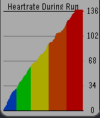
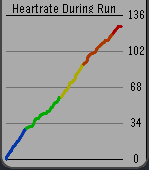

# pebble-graph

`pebble-graph` is a minimal graphing library for the pebble watch




## Quick start

There are 2 options to get working with `pebble-graph`
1. install the npm package `pebble package install pebble-graph`
2. Manually copy and paste both `pebble-graph.h` and `pebble-graph.c` into your project, then `#include "pebble-graph.h"` as you would any other header

Project Examples are in `examples/`.
```
cd examples/line
pebble build
pebble install --emulator basalt
```
